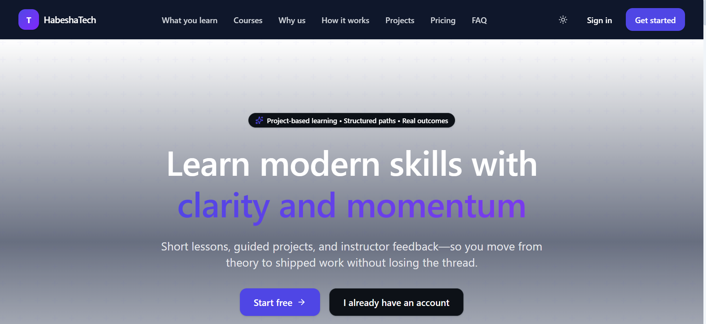
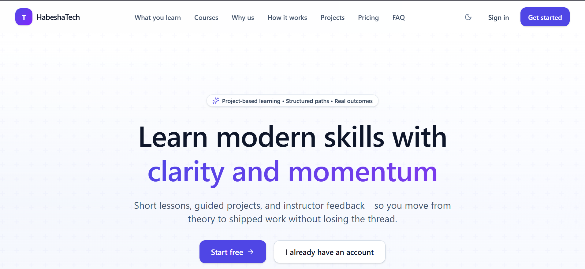
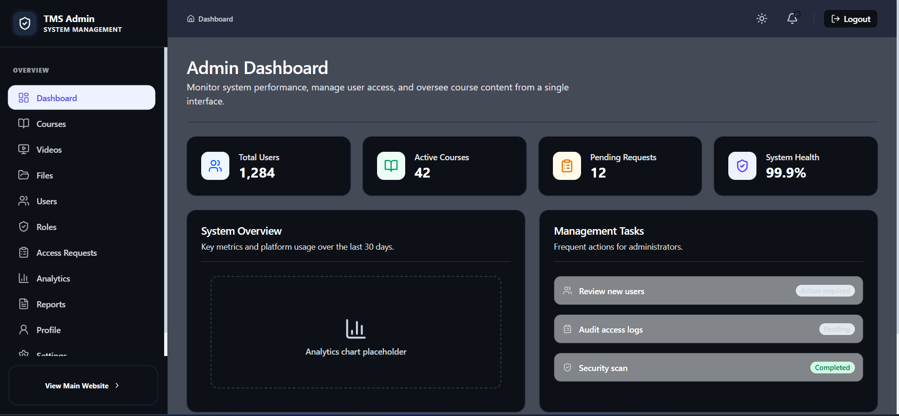
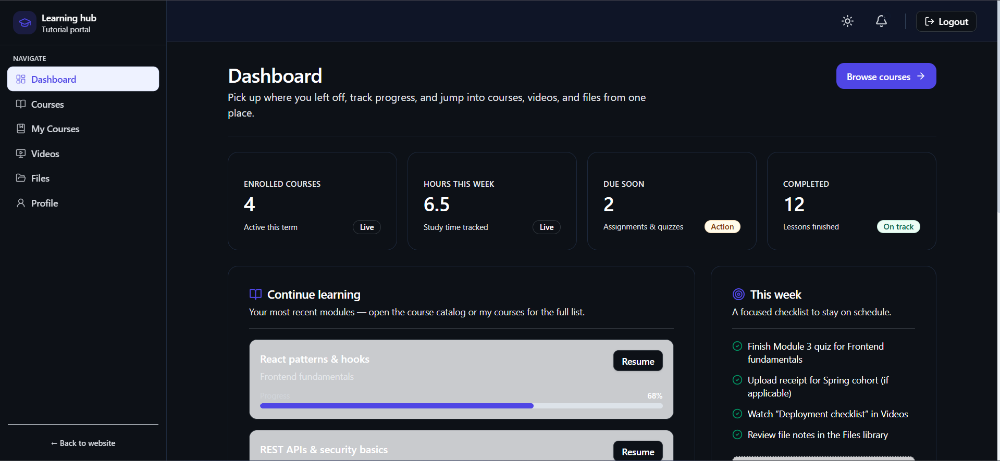

# Tutorial Management System (TMS) - Frontend

A modern, high-performance, and visually stunning student learning platform and administrative dashboard. This website has admin and user dashboard. The admin creates courses, uploads youtube videos (Youtube url embed), upload course files for students. Also the admin controles users and variety of user roles. The admin can create a new role and assign courses to it. Then roles are assigned to users as per the courses they have subscribed. 

The user dashboard allows users to see all available courses in teh system and buy course by uploading payment receipts. Payment gateway isn't integrated in this verison. The admin approves their receipts and then give access to the course. 

The system also has an appealing landing page dedicated to attract clients/course subscribers.

---

<!-- [SCREENSHOT: Landing Page - Hero Section] -->
## Landing Page (Hero Section in Dark Mode)


## 🚀 Key Features

### 🎓 Learner Experience
- **Interactive Course Catalog**: Browse structured learning paths with advanced filtering and search.
- **Project-Based Learning**: Integrated dashboards to track progress across lessons and hands-on milestones.
- **Unified Learning Hub**: Access videos, course materials (PDFs/Slides), and instructor feedback in one cohesive UI.
- **Customizable Dashboard**: Real-time stats on enrollment, completed modules, and upcoming targets.

### 🛡️ Administrative Suite
- **Comprehensive User Management**: Real-time role assignment and account status control.
- **Resource Management**: Seamlessly upload and organize video lessons and static course materials.
- **Access Request System**: Manage student enrollments and payment tracking through a responsive, card-based interface.
- **Role-Based Workspaces**: Tailored environments for Admins and Learners using a unified "Shell" architecture.

### 🌓 Premium Experience
- **Dynamic Dark Mode**: A deep-slate, high-contrast dark theme that persists across sessions and respects system preferences.
- **Unified Design System**: Cohesive design language across Public, Student, and Admin portals.
- **Fully Responsive**: Optimized for every device—from administrative desktops to mobile learning.

---

<!-- [SCREENSHOT: Light Mode Toggle Demonstration] -->
## Landing Page Light Mode


## 🛠️ Tech Stack

- **Framework**: [React 18+](https://react.dev/) with [Vite](https://vitejs.dev/)
- **Core**: TypeScript for strict type safety and robust developer experience
- **Styling**: [Tailwind CSS v4](https://tailwindcss.com/) (using advanced `@custom-variant` and JIT engine)
- **Icons**: [Lucide React](https://lucide.dev/) for consistent, accessible iconography
- **State Management**: React Context API (Auth, Theme)
- **Routing**: React Router DOM (v6+)

---

## 📂 Project Structure

```text
tms-frontend/
├── src/
│   ├── components/       # Reusable components
│   │   ├── landing/      # Landing page specific sections
│   │   ├── layout/       # Shared Shells, Headers, and Footers
│   │   ├── ui/           # Core UI Library (Buttons, Cards, Inputs, etc.)
│   │   └── dashboard/    # Admin/User specific dashboards
│   ├── context/          # Auth and Theme providers
│   ├── hooks/            # Custom hooks (useAuth, useTheme)
│   ├── services/         # API service layer (Axios-based)
│   ├── pages/            # Page-level components (Admin, User, Public)
│   ├── routes/           # Routing configuration
│   ├── utils/            # Shared utilities (cn, formatting)
│   └── index.css         # Global styles & Tailwind configuration
└── public/               # Static assets
```

---

## 🏁 Getting Started

### Prerequisites
- [Node.js](https://nodejs.org/) (v18 or higher recommended)
- [npm](https://www.npmjs.com/) or [pnpm](https://pnpm.io/)

### Installation

1. **Clone the repository**
   ```bash
   git clone <https://github.com/Abdurezak-Akmel/tms-frontend.git>
   cd tms-frontend
   ```

2. **Install dependencies**
   ```bash
   npm install
   ```

3. **Environment Setup**
   Create a `.env` file in the root directory and add your API base URL:
   ```env
   VITE_API_BASE_URL=http://localhost:5000/api
   ```

4. **Launch Development Server**
   ```bash
   npm run dev
   ```

---

<!-- [SCREENSHOT: Admin Dashboard Overview] -->
## Admin Dashboard


## User Dashboard


## 🎨 UI & UX Design Principles

- **Aesthetics First**: Every component is designed with vibrant colors, smooth transitions, and glassmorphism elements where appropriate.
- **Accessibility**: Semantic HTML and ARIA labels ensure the platform is usable by everyone.
- **Micro-Animations**: Hover effects and state transitions provide immediate, satisfying feedback to users.
- **Text Visibility**: Custom-tuned contrast ratios in both light and dark modes for optimal readability.

---

Developed with ❤️ by Abdurezak Akmel from HabeshaTech Team.
